# IoT Data Quality Pipeline

A comprehensive system for detecting, classifying, propagating, and interpreting data quality issues in IoT environments, based on the research framework for explainable process analytics.

## Overview

Instead of treating data quality issues as problems to be filtered out, this system **propagates them through the entire data pipeline** and transforms them into **valuable insights** about the IoT environment. The core philosophy is that data quality issues carry meaningful information about system behavior, sensor infrastructure, and organizational processes.

### Pipeline Stages

```mermaid
%%{init: {
  "theme": "base",
  "themeVariables": {
    "textColor": "#111111",
    "lineColor": "#222222",
    "fontSize": "16px",
    "clusterBkg": "#f8f9fa",
    "clusterBorder": "#333333"
  }
}}%%
graph TB
    subgraph DataCollection["📊 Stage 1-4: Data Collection & Processing"]
        Raw["Raw Sensor Data"] --> Detect1["Quality Detection<br/>Detects: C1, C2, C3, C4, C5"]
        Detect1 --> Prep["Preprocessing<br/>Preserves quality signatures"]
        Prep --> Events["Event Abstraction<br/>Tracks quality in events"]
        Events --> Cases["Case Correlation<br/>Propagates quality to cases"]
        
        Detect1 -.quality issues.-> QI1["Initial Quality Issues<br/>confidence scores"]
    end
    
    Cases --> PM["📈 Stage 5: Process Mining<br/>with pm4py Inductive Miner"]
    
    subgraph ProcessMining["🔬 pm4py Process Discovery"]
        PM --> EventLog["Convert to pm4py<br/>Event Log Format<br/>+ case_quality_score<br/>+ num_quality_issues"]
        
        EventLog --> InductiveMiner["Inductive Miner (IMf)<br/>noise_threshold: 0.2<br/>Discovers: Petri Net Model"]
        
        InductiveMiner --> PetriNet["Petri Net Model<br/>Places, Transitions, Arcs"]
    end
    
    subgraph ConformanceChecking["✅ Stage 6: Conformance Checking"]
        PetriNet --> Replay["Token-Based Replay"]
        EventLog --> Replay
        
        Replay --> Fitness["Fitness Calculation<br/>How well traces fit model<br/>fitness = trace_fitness_avg"]
        
        PetriNet --> PrecisionCalc["Precision Calculation<br/>How specific is model<br/>precision = 1 - escaped_arcs"]
        EventLog --> PrecisionCalc
        
        PetriNet --> Simplicity["Simplicity Calculation<br/>Model complexity<br/>simplicity = 1 / (arcs + places)"]
        
        PetriNet --> Generalization["Generalization Calculation<br/>Model coverage"]
        EventLog --> Generalization
    end
    
    Fitness --> ConformanceMetrics["Conformance Metrics<br/>━━━━━━━━━━━━━━━━━<br/>fitness: 0.68 ❌<br/>precision: 0.82 ✓<br/>simplicity: 0.45 ❌<br/>generalization: 0.75 ✓"]
    PrecisionCalc --> ConformanceMetrics
    Simplicity --> ConformanceMetrics
    Generalization --> ConformanceMetrics
    
    ConformanceMetrics --> ThresholdCheck{"Conformance Check<br/>━━━━━━━━━━━━━━━<br/>fitness < 0.7?<br/>precision < 0.7?<br/>simplicity < 0.5?"}
    
    ThresholdCheck -->|"YES - Issues Found"| ConfIssues["Conformance Issues Detected<br/>━━━━━━━━━━━━━━━━━━━━━━━<br/>1. Low Fitness (0.68)<br/>2. High Complexity (simplicity: 0.45)<br/>Severity: HIGH"]
    
    ThresholdCheck -->|"NO - Quality OK"| NoIssues["✓ Model Quality Acceptable<br/>Continue to visualization"]
    
    subgraph Backtracking["🔙 Stage 7: Conformance-Based Backtracking"]
        ConfIssues --> BackTrack["Backtracking Analysis<br/>Link conformance → quality issues"]
        
        Cases -.case quality data.-> BackTrack
        QI1 -.initial issues.-> BackTrack
        
        BackTrack --> AnalyzeCases["Analyze Affected Cases<br/>━━━━━━━━━━━━━━━━━━━━━<br/>Filter: case_quality_score < 0.7<br/>Result: 12 low-quality cases"]
        
        AnalyzeCases --> ExtractIssues["Extract Quality Issues<br/>from Affected Cases<br/>━━━━━━━━━━━━━━━━━━━━━<br/>C1: 8 occurrences<br/>C3: 6 occurrences<br/>C5: 3 occurrences"]
        
        ExtractIssues --> Correlate["Correlate with Conformance<br/>━━━━━━━━━━━━━━━━━━━━━━━━<br/>Low Fitness ← C1 (inadequate sampling)<br/>P(C1|low_fitness) = 0.87<br/><br/>High Complexity ← C3 (sensor noise)<br/>P(C3|complexity) = 0.94"]
        
        Correlate --> BuildPath["Build Backtrack Path<br/>━━━━━━━━━━━━━━━━━━━━━<br/>Stage 5: fitness=0.68 ❌<br/>Stage 4: 12 incomplete cases<br/>Stage 3: 8 missing events<br/>Stage 2: 15 data gaps<br/>Stage 1: sampling_rate=0.45Hz"]
    end
    
    subgraph CausalReasoning["🧠 Stage 8: Causal Reasoning"]
        BuildPath --> CausalChain["Construct Causal Chain<br/>━━━━━━━━━━━━━━━━━━━━━━━<br/>ROOT: sampling_rate=0.45Hz (C1)<br/>⬇️ P=0.92<br/>Missing short-duration events (8)<br/>⬇️ P=0.88<br/>Incomplete process instances (12)<br/>⬇️ P=0.85<br/>EFFECT: Low fitness (0.68)"]
        
        CausalChain --> Evidence["Evidence Chain<br/>━━━━━━━━━━━━━━━━<br/>Model: fitness=0.68<br/>Cases: 12 affected<br/>Events: 8 missing<br/>Raw: gaps=15, rate=0.45Hz<br/>Chain Strength: 0.69"]
        
        Evidence --> Explanation["Root Cause Explanation<br/>━━━━━━━━━━━━━━━━━━━━━━━━━<br/>Issue: C1 Inadequate Sampling<br/>Confidence: 0.87<br/>Explanation: Low sampling rate<br/>causes fast events to be missed,<br/>resulting in incomplete traces<br/>that reduce model fitness"]
    end
    
    subgraph ActionableOutput["🎯 Stage 9: Actionable Insights"]
        Explanation --> Insights["Generate Insights<br/>━━━━━━━━━━━━━━━━<br/>1. Root Cause Identified<br/>2. Impact Quantified<br/>3. Affected Sensors Listed<br/>4. Solution Proposed"]
        
        Insights --> Insight1["Insight 1 (Confidence: 0.87)<br/>━━━━━━━━━━━━━━━━━━━━━━━━━━<br/>Problem: Sensor WS_01_PWR<br/>has sampling_rate=0.45Hz<br/><br/>Impact: 8 weld events missed<br/>→ 12 incomplete cases<br/>→ Model fitness -32%<br/><br/>Solution: Update config to 2Hz<br/>Priority: CRITICAL<br/>Expected Improvement: +32%"]
        
        Insights --> Insight2["Insight 2 (Confidence: 0.94)<br/>━━━━━━━━━━━━━━━━━━━━━━━━━━<br/>Problem: Sensor WS_02_TEMP<br/>has noise_level=0.12<br/><br/>Impact: 23 false event paths<br/>→ Spaghetti model<br/>→ Complexity +45%<br/><br/>Solution: Calibrate sensor<br/>Priority: HIGH<br/>Expected Improvement: -40% complexity"]
    end
    
    Insight1 --> FinalReport["📊 Final Report<br/>━━━━━━━━━━━━━━━━━━━━━━━━━━━━<br/>✓ Conformance issues detected<br/>✓ Root causes identified via backtracking<br/>✓ Causal chains constructed (P=0.87)<br/>✓ 2 critical actions recommended<br/>✓ Expected ROI: 30-40% improvement"]
    Insight2 --> FinalReport
    
    NoIssues -.no backtracking needed.-> FinalReport

    
    FinalReport --> Value["🎯 Business Value<br/>━━━━━━━━━━━━━━━━━━━━━━<br/>• Detects issues at MODEL level<br/>• Traces back to RAW DATA causes<br/>• Provides SPECIFIC sensor fixes<br/>• Quantifies EXPECTED improvements<br/>• Prevents WRONG decisions from bad models"]
    
    %% High-contrast styles (black text, darker borders)
    style DataCollection fill:#CFE8FF,stroke:#1D4ED8,stroke-width:1.5px,color:#111111
    style ProcessMining fill:#FFE5B4,stroke:#B45309,stroke-width:1.5px,color:#111111
    style ConformanceChecking fill:#D3F9D8,stroke:#15803D,stroke-width:1.5px,color:#111111
    style Backtracking fill:#FFD9E1,stroke:#BE185D,stroke-width:1.5px,color:#111111
    style CausalReasoning fill:#E6D4FF,stroke:#6D28D9,stroke-width:1.5px,color:#111111
    style ActionableOutput fill:#D0F0FF,stroke:#0EA5E9,stroke-width:1.5px,color:#111111
    
    style ThresholdCheck fill:#FFF3BF,stroke:#A16207,stroke-width:1.5px,color:#111111
    style ConfIssues fill:#FFC2CC,stroke:#9D174D,stroke-width:1.5px,color:#111111
    style NoIssues fill:#B7F0C0,stroke:#15803D,stroke-width:1.5px,color:#111111
    style CausalChain fill:#FFC9C9,stroke:#B91C1C,stroke-width:1.5px,color:#111111
    style FinalReport fill:#B7E4C7,stroke:#166534,stroke-width:1.5px,color:#111111
    style Value fill:#95D5B2,stroke:#14532D,stroke-width:1.5px,color:#111111

```


## Key Features

### 🔍 **Quality Issue Detection & Classification**
- **C1: Inadequate Sampling Rate** - Detects when sensors sample too slowly for process dynamics
- **C2: Poor Sensor Placement** - Identifies overlapping or inconsistent sensor readings
- **C3: Sensor Noise & Outliers** - Finds high variance and erroneous readings
- **C4: Sensor Range Too Small** - Detects blind spots and value clipping
- **C5: High Data Volume** - Identifies processing bottlenecks and data loss

### 📊 **Quality-Aware Pipeline**
- **Preprocessing** - Gentle data cleaning while preserving quality signatures
- **Event Abstraction** - Converts sensor data to structured events with quality annotations
- **Case Correlation** - Groups events into process instances with quality assessment
- **Process Mining** - Discovers process models using quality-weighted algorithms
- **Enhanced Visualization** - Creates quality-annotated process visualizations

### 💡 **Explainable Insights**
- **Root Cause Analysis** - Links observed effects to underlying causes
- **Information Gain Metrics** - Quantifies interpretability and actionability
- **Actionable Recommendations** - Provides specific remediation strategies
- **Causal Chain Detection** - Identifies how issues propagate through stages

### 🏭 **Synthetic IoT Environment**
- **Realistic Sensor Models** - Power, temperature, vibration, position sensors
- **Manufacturing Processes** - Welding, inspection, packaging stations
- **Configurable Quality Issues** - Controllable issue injection for testing
- **Multi-Station Workflows** - Complex process instances across machines

## Installation

```bash
# Clone the repository
git clone <repository-url>
cd iot-data-quality-pipeline

# Install dependencies
pip install -r requirements.txt

# Run the demo
python demo.py
```

## Quick Start

```python
from src.synthetic_environment.iot_environment import IoTEnvironment
from src.pipeline.pipeline_manager import PipelineManager
from src.explainability.insights import InsightGenerator

# Create synthetic IoT environment
env = IoTEnvironment(name="Manufacturing Line", duration_hours=8)
env.add_welding_station()
env.add_inspection_station()
env.add_packaging_station()

# Generate data with quality issues
data = env.generate_data()

# Run quality-aware pipeline
pipeline = PipelineManager()
results = pipeline.run(data, env)

# Generate explainable insights
insight_generator = InsightGenerator()
insights = insight_generator.generate_insights(results)

# Display results
for insight in insights[:5]:
    print(f"• {insight['message']}")
    print(f"  Confidence: {insight['confidence']:.2f}")
    print(f"  Actionable: {insight['actionable']}")
```

## Architecture

```
📁 src/
├── 📁 synthetic_environment/     # IoT environment simulation
│   ├── iot_environment.py       # Main environment class
│   ├── sensor_models.py         # Sensor implementations
│   └── data_generator.py        # Synthetic data generation
├── 📁 data_quality/             # Quality issue detection
│   ├── detectors.py             # Issue detection algorithms
│   ├── classifiers.py           # Probabilistic classification
│   └── propagation.py           # Cross-stage propagation
├── 📁 pipeline/                 # Data processing pipeline
│   ├── pipeline_manager.py      # Main pipeline orchestrator
│   ├── preprocessing.py         # Quality-aware preprocessing
│   ├── event_abstraction.py     # Sensor data → events
│   ├── case_correlation.py      # Events → process instances
│   ├── process_mining.py        # Quality-weighted process discovery
│   └── visualization.py         # Enhanced visualizations
├── 📁 explainability/           # Insights and explanations
│   ├── insights.py              # Insight generation
│   └── explanations.py          # Detailed explanations
└── 📁 config/                   # Configuration
    └── settings.py              # System parameters
```

## Example Results

### Quality Issues Detected
```
📊 QUALITY ISSUES DETECTED: 12
  C1_inadequate_sampling: 3 instances
    • Low sampling rate: 0.45 Hz (Confidence: 0.85)
    • Detected 15 large sampling gaps (Confidence: 0.78)
  C3_sensor_noise: 4 instances  
    • 156 outliers (18.2% of readings) (Confidence: 0.92)
    • High noise level: 0.134 (Confidence: 0.71)
```

### Process Model Metrics
```
🔄 PROCESS MODEL METRICS:
  Fitness Score: 0.734
  Precision Score: 0.892
  Complexity Score: 0.456
  Quality-Weighted Fitness: 0.681
  Activities Discovered: 11
  Causality Relations: 18
```

### Generated Insights
```
💡 GENERATED INSIGHTS: 8
  1. Most prevalent quality issue: C3_sensor_noise (4 occurrences)
     Confidence: 0.90 | Actionable: True
     Recommendations: Check sensor calibration, Review electrical interference
  
  2. Sensor WS_01_PWR has multiple quality issues: C1_inadequate_sampling, C3_sensor_noise
     Confidence: 0.85 | Actionable: True
     Recommendations: Prioritize maintenance, Update sensor sampling configuration
```

## Key Concepts

### Information Gain Framework
Quality issues are reframed as sources of information:
- **Interpretability Gain** - How much insight the issue provides
- **Actionability Gain** - How clearly it points to specific actions
- **Explainability Gain** - How well it explains observed phenomena

### Probabilistic Reasoning
Uses Bayesian inference to handle uncertainty:
```python
P(C1_inadequate_sampling) = 0.85  # High likelihood
P(C2_poor_placement) = 0.23       # Lower likelihood  
P(C3_sensor_noise) = 0.67         # Moderate likelihood
```

### Quality Propagation
Issues propagate through pipeline stages with evolving signatures:
- **Raw Data** → irregular_sampling, high_variance
- **Events** → missing_events, false_events  
- **Process Model** → incomplete_paths, spaghetti_model

## Research Background

This implementation is based on the research concept of **propagating data quality issues through IoT process analytics pipelines** rather than filtering them out. The key insight is that quality issues contain valuable information about:

- **IoT Infrastructure** - Sensor placement, configuration, maintenance needs
- **Process Understanding** - Hidden process variants, timing dependencies
- **System Health** - Degradation patterns, failure prediction
- **Organizational Factors** - Process changes, equipment updates

## Use Cases

### Manufacturing
- **Predictive Maintenance** - Quality issues indicate sensor degradation
- **Process Optimization** - Missing events reveal hidden process steps
- **Equipment Monitoring** - Noise patterns suggest mechanical issues

### Smart Buildings
- **HVAC Optimization** - Sensor placement issues affect control accuracy
- **Energy Management** - Data gaps indicate measurement blind spots
- **Occupancy Analysis** - Quality patterns reveal usage patterns

### Healthcare IoT
- **Patient Monitoring** - Sensor issues affect care quality
- **Equipment Management** - Quality trends predict device failures
- **Workflow Analysis** - Data issues reveal process inefficiencies

## Contributing

1. Fork the repository
2. Create a feature branch: `git checkout -b feature-name`
3. Make your changes and add tests
4. Commit: `git commit -am 'Add feature'`
5. Push: `git push origin feature-name`
6. Create a Pull Request

## License

This project is licensed under the MIT License - see LICENSE file for details.

## Citation

If you use this system in your research, please cite:

```bibtex
@software{iot_data_quality_pipeline,
  title={IoT Data Quality Pipeline: Explainable Process Analytics},
  author={[Author Name]},
  year={2024},
  url={[Repository URL]}
}
```

## Contact

For questions, issues, or collaboration opportunities, please open an issue on GitHub or contact [contact information].

---

**Note**: This system transforms the traditional view of data quality from "problems to be solved" to "insights to be leveraged" for better IoT system understanding and management.